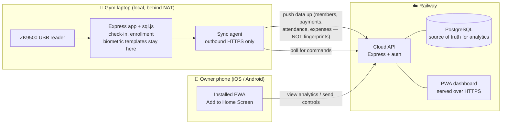

# Cloud Deployment + Owner App — Plan

How to put Demo Gym on Railway and give the owner a remote analytics + controls
app **forever, free, with no App Store or Play Store**.

Decisions locked in (from our conversation):

- **Owner uses both iOS and Android.**
- **The "app" is an installable web app (PWA)** — not a native build.
- **Hybrid architecture** — the gym laptop keeps the ZK9500 fingerprint check-in
  and syncs to the cloud; the owner sees analytics and sends controls remotely.

---

## The short answers to your questions

**Can the Expo app be deployed on Railway?** No. Railway hosts *servers and
databases* (containers), not native mobile apps. A native iOS/Android binary is
built separately by Expo's EAS Build and installed on a phone — it never "lives"
on Railway. Railway *can* host your API and a **web** version of the dashboard.

**Can I give them the app indefinitely without the App Store / Play Store?**
Yes — by making the owner app a **PWA** (a web dashboard they "Add to Home
Screen"). It installs like an app, has its own icon, runs full-screen, works on
both iOS and Android, updates instantly, and costs nothing to distribute. No
store, no $99/yr Apple account, no yearly re-signing. (A native Expo app is still
possible later — free to sideload on Android via an APK, but on iOS Apple only
allows it with a $99/yr developer account and re-signing roughly every 12 months.
That's the trade-off that makes the PWA the right first move.)

---

## Architecture

Three pieces:

1. **Gym laptop (the "edge").** Keeps running exactly what you have today — the
   Express app, the sql.js database, and the ZK9500 reader. This is mandatory: a
   USB fingerprint reader physically plugged into the gym cannot be reached from a
   cloud server. The laptop gains one new thing — a small **sync agent** that
   makes *outbound* HTTPS calls to the cloud. Because it's outbound-only, you
   never open a port or expose the laptop to the internet, and it works fine
   behind the gym's normal router.

2. **Railway cloud.** A web service (your Express API, adapted to talk to
   Postgres) + a managed **PostgreSQL** database that holds the cloud copy of the
   data for analytics and remote control. The same service also serves the
   **PWA** to the owner's phone over HTTPS (service workers require HTTPS, which
   Railway gives you automatically).

3. **Owner PWA.** A responsive dashboard the owner installs to their home screen.
   It talks only to the cloud API — never directly to the laptop.

---

## What has to change in the code

Your current app is offline-first with **no authentication** and a single-file
database. None of that is wrong — it's right for a trusted local LAN — but going
to the cloud needs four additions. None require a rewrite; the REST API in
`server/routes.js` is already a clean foundation.

1. **Authentication (the #1 blocker).** Today anyone who can reach the server has
   full access, and the Owner/Receptionist roles are a client-side switch only.
   Before anything is exposed to the internet, add real login + server-enforced
   roles (JWT or sessions) gating every `/api` route on the cloud.

2. **A database adapter.** Keep `sql.js` on the laptop (it's perfect there). On
   the cloud, run **Postgres**. Introduce a thin adapter so the same route
   handlers run against either. Schema port is straightforward — your types are
   plain `INTEGER`/`TEXT`; the only `BLOB` columns are the fingerprint templates,
   which **stay on the laptop and are never uploaded** (biometric data — keep it
   local for privacy and to shrink your liability).

3. **A sync agent + sync endpoints.** The laptop pushes new/changed members,
   payments, expenses, staff and check-ins up to the cloud, and pulls down a queue
   of owner commands (see next section). One catch to fix: your `nextCode()`
   helper generates IDs with `max + 1`, which collides if two places insert at
   once. The sync upserts **by the laptop-issued code** and lets the laptop remain
   the only creator of records, which sidesteps the collision entirely.

4. **PWA assets.** A `manifest.json`, a service worker, and app icons so the
   dashboard is installable. The owner UI can reuse your existing screens
   (Dashboard, Members, Payments, Expenses, Reports, Settings) and Chart.js — just
   pointed at the cloud API and auth-gated. The **Scan** screen stays laptop-only.

---

## The sync model (kept deliberately simple and safe)

The laptop is the **single writer**. This avoids the hardest problem in
distributed systems (two masters editing the same row) entirely.

- **Data flows up** continuously: after each change and on a short timer, the sync
  agent posts new/updated rows to the cloud. The owner's analytics are therefore
  near-live whenever the laptop is online, and the last synced snapshot stays
  viewable even when it isn't.
- **Controls flow down as commands.** When the owner does something that must
  change the gym's records — suspend/reactivate a member, record a payment, edit a
  member, add an expense, change pricing tiers — the PWA writes a *command* to the
  cloud. The laptop's agent polls, applies it locally (so the laptop is still the
  only writer), and pushes the result back up. The owner sees confirmation within
  seconds. If the laptop is offline, the command simply queues until it
  reconnects.
- **Pure cloud actions** (viewing reports, changing the owner's own view) need no
  laptop round-trip and are instant.

---

## Implementation phases

| Phase | What | Outcome |
|---|---|---|
| **0 — Prep** | Add a DB adapter so routes run on sql.js (local) or Postgres (cloud). Decide repo layout (one repo, separate `cloud` + `pwa` entry points). | No behaviour change; ready to branch local vs cloud. |
| **1 — Cloud API + Postgres + Auth** | Provision Railway (web service + Postgres). Port schema to Postgres. Add login + server-side roles. Deploy. | Owner can log in to a secure cloud URL (empty data at first). |
| **2 — Sync up** | Build the laptop sync agent (outbound HTTPS, device token) + cloud upsert endpoints. Exclude fingerprint templates. | Real, near-live gym data visible in the cloud. |
| **3 — PWA** | Add manifest, service worker, icons; build the owner dashboard against the cloud API. | Owner installs the app to their home screen (iOS + Android). |
| **4 — Remote controls** | Command queue: PWA → cloud → laptop applies → result synced back. | Owner can actually run the business remotely. |
| **5 — (optional) Native app** | Only if you later want push notifications / native feel. Android = free APK; iOS = $99/yr + yearly re-sign. | Native app, distributed without the stores. |

Phases 1–4 are the real project. Phase 5 is genuinely optional and I'd skip it
unless push notifications become a must-have.

---

## Deploying to Railway (concrete steps)

Your repo is already on GitHub (`Ha55anAJ/workout-gym-pos`) and the app already
reads `process.env.PORT`, so Railway needs little massaging.

1. Create a Railway project → **Deploy from GitHub repo** → pick the repo.
2. Add a **PostgreSQL** database (Railway → New → Database → PostgreSQL).
3. Set environment variables on the web service:
   - `DATABASE_URL` → reference the Postgres service (Railway injects it)
   - `JWT_SECRET` → a long random string
   - `SYNC_DEVICE_TOKEN` → a secret the laptop uses to authenticate to the cloud
   - `NODE_ENV=production`
   - (`PORT` is set by Railway automatically — no action needed)
4. Set the start command to the **cloud** entry point (the Postgres-backed one),
   not the local fingerprint server.
5. Deploy. Railway gives you an HTTPS URL like
   `https://gym-production.up.railway.app` (HTTPS is required for the PWA — you
   get it for free).
6. Point the laptop's sync agent and the PWA at that URL. Optionally attach a
   custom domain (~$10/yr) for a nicer address; not required.

---

## Giving the owner the app — forever, no store

Once the PWA is live at the Railway URL:

- **iPhone/iPad:** open the URL in **Safari** → Share → **Add to Home Screen**.
  An icon appears; it launches full-screen like an app. (On iOS the install must
  be done in Safari; this is the only real "gotcha.")
- **Android:** open the URL in **Chrome** → it offers **Install app** (or menu →
  Add to Home Screen).

That's it — no store listing, no review, no account, no expiry. When you ship an
update, it's live for them on next open. This is the core reason the PWA route
satisfies "give it to them indefinitely."

---

## Costs

| Item | Cost | Notes |
|---|---|---|
| Railway (web service + Postgres) | **~$5/mo** | Hobby plan minimum; ample for one gym. $5 trial credit to start. |
| PWA distribution | **$0** | Forever, both platforms, no store. |
| Custom domain (optional) | ~$10/yr | Nicer URL; Railway's free subdomain works fine. |
| Apple / Google fees | **$0** | Only needed if you later ship a *native* app (iOS $99/yr). |

Realistically this is **~$5/month, all-in**, with no per-user or per-device cost
and nothing that expires.

---

## Security checklist (do these before exposing anything)

- [ ] Add authentication + server-enforced roles (none exists today).
- [ ] Keep fingerprint templates **on the laptop only** — never upload biometric data.
- [ ] Laptop stays **outbound-only** (no inbound ports, stays behind the router).
- [ ] HTTPS everywhere (Railway provides it).
- [ ] Secrets (`JWT_SECRET`, `SYNC_DEVICE_TOKEN`) in env vars, not in code.
- [ ] Rate-limit + validate input on the cloud API.
- [ ] Back up Postgres (Railway backups) and keep the local `.db` backups too.

---

## Risks & caveats (so there are no surprises)

- **iOS PWA limits:** install is Safari-only; push notifications need iOS 16.4+
  and are limited; no background sync. All fine for a dashboard, but it's why a
  native app is the only path to rich iOS push later.
- **Laptop must be online** for live check-in and for owner commands to apply in
  real time. Already-synced analytics remain viewable any time.
- **Owner commands queue** when the laptop is offline and apply on reconnect
  (seconds of latency in the normal online case).
- **Don't skip auth.** Putting the current no-auth app on a public URL would
  expose all member and financial data. Phase 1 must land before any real data
  syncs.

---

## Recommended next step

Start **Phase 1**: stand up the Railway project (web service + Postgres), add the
database adapter and authentication, and deploy a secure — initially empty —
cloud instance you can log into. That de-risks everything else and gives you a
real URL to build the PWA against. I can begin on that whenever you're ready.
